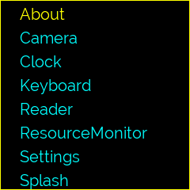

# enamelware - an application framework

This is an application framework intended for building small applications that use non standard displays and input methods. 

If your application interface will be displayed on a small lcd or oled connected to gpio pins, for example on a Raspberry Pi, or you want your display to be sent over a web socket or you just need a simple application framework to build a desktop widget then then this library may meet your requirements.

Application user interfaces are images and text drawn on a Pillow `ImageDraw` (https://pillow.readthedocs.io/) canvas which are then rendered on the configured displays. The user interfaces can be displayed on more than one display device and a number of different devices are available - small oled and lcd displays running on an SPI or I2c bus, display emulators, web sockets, gifs or recorded to images files.

Support is also included for non standard input devices for systems where there is no keyboard available. For example an application could be controlled by a joystick, rotary encoder or keystrokes forwarded to the application over a web socket or other message bus.

Applications running in the framework are implemented as sub classes of a base `App` class. The `Apps` are loaded from a pre-defined application directory and the framework then takes care of executing and managing the the applications on an application stack.

